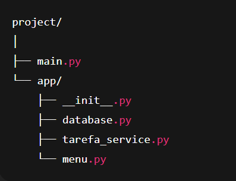

# Gerenciador de Tarefas em Python (com SQLite)

Este projeto é um gerenciador de tarefas simples, desenvolvido para praticar organização de código (RAD), manipulação de banco de dados e uso de módulos em Python.
O sistema funciona pelo terminal e utiliza o banco SQLite para salvar as tarefas.

📁 Estrutura do Projeto

O projeto foi organizado em pastas para deixar o código mais limpo e fácil de entender:

main.py → arquivo principal, inicia o sistema

database.py → cria o banco e cuida da conexão

tarefa_service.py → funções que manipulam as tarefas

menu.py → interface simples pelo terminal

tarefas.db → banco criado automaticamente na primeira execução

🧠 Funcionalidades

O sistema permite:

➕ Adicionar nova tarefa

📄 Listar tarefas (todas, por prioridade ou por status)

✔️ Marcar tarefa como concluída

🗑️ Excluir uma tarefa

💾 Banco de dados criado automaticamente

▶️ Como Executar

Certifique-se de que o Python está instalado.

Abra o terminal dentro da pasta do projeto.

Execute:

python main.py

O banco tarefas.db será criado automaticamente.

🗂 Banco de Dados

A tabela utilizada é:

tarefas(
    id INTEGER PRIMARY KEY AUTOINCREMENT,
    titulo TEXT,
    descricao TEXT,
    prioridade TEXT,
    concluida INTEGER,
    data_criacao TEXT
)

✔️ Observação

O código foi escrito de forma simples, usando apenas recursos básicos de Python e SQLite, ideal para estudo ou atividade acadêmica.